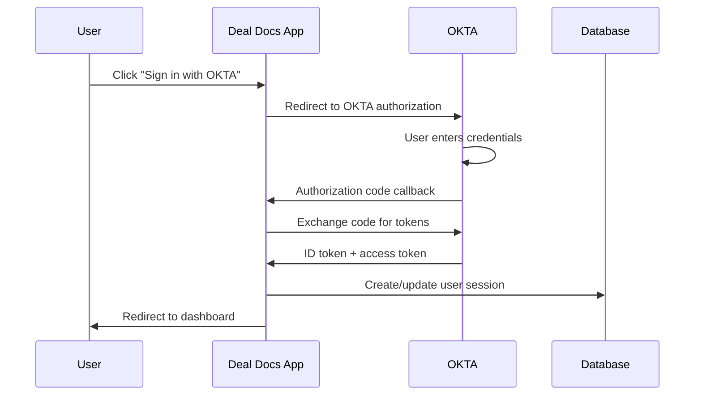

# Deal Docs Architecture Overview

Comprehensive technical architecture guide for developers working on Deal Docs.

## 🏗️ System Architecture

### High-Level Stack
```
┌─────────────────────────────────────────────────────────────┐
│                    Frontend (Next.js 14)                   │
│  ┌─────────────────┐ ┌─────────────────┐ ┌───────────────┐ │
│  │   App Router    │ │  Pages Router   │ │  Components   │ │
│  │   (New Pages)   │ │  (Legacy API)   │ │  (shadcn/ui)  │ │
│  └─────────────────┘ └─────────────────┘ └───────────────┘ │
└─────────────────────────────────────────────────────────────┘
                              │
┌─────────────────────────────────────────────────────────────┐
│                   Authentication Layer                     │
│  ┌─────────────────┐ ┌─────────────────┐ ┌───────────────┐ │
│  │  NextAuth.js    │ │   OKTA OIDC     │ │    Passkey    │ │
│  │  (Core Auth)    │ │ (Enterprise)    │ │  (Advanced)   │ │
│  └─────────────────┘ └─────────────────┘ └───────────────┘ │
└─────────────────────────────────────────────────────────────┘
                              │
┌─────────────────────────────────────────────────────────────┐
│                    Business Logic                          │
│  ┌─────────────────┐ ┌─────────────────┐ ┌───────────────┐ │
│  │   API Routes    │ │  Server Actions │ │  Middleware   │ │
│  │  (pages/api)    │ │  (App Router)   │ │  (Security)   │ │
│  └─────────────────┘ └─────────────────┘ └───────────────┘ │
└─────────────────────────────────────────────────────────────┘
                              │
┌─────────────────────────────────────────────────────────────┐
│                    Data Layer                              │
│  ┌─────────────────┐ ┌─────────────────┐ ┌───────────────┐ │
│  │    Prisma ORM   │ │  PostgreSQL     │ │   File Store  │ │
│  │   (72+ Tables)  │ │    (Neon)       │ │ (Vercel Blob) │ │
│  └─────────────────┘ └─────────────────┘ └───────────────┘ │
└─────────────────────────────────────────────────────────────┘
```

## 🔐 Authentication Flow

### OKTA OIDC Integration (Primary)


**Configuration Files:**
- `pages/api/auth/[...nextauth].ts` - OKTA provider setup
- `app/(auth)/login/page-client.tsx` - Login UI with OKTA button
- Environment variables: `OKTA_CLIENT_ID`, `OKTA_CLIENT_SECRET`, `OKTA_ISSUER`

### Multi-Provider Support
```typescript
// Supported authentication methods
type LoginType = "passkey" | "google" | "credentials" | "linkedin" | "okta";

// NextAuth providers configured:
- OKTA OIDC (Primary enterprise)
- Google OAuth (Secondary)
- Email/Credentials (Fallback)
- LinkedIn (Social)
- Passkey (Advanced security)
```

## 🏢 Enterprise Feature Architecture

### Self-Hosted Subscription Bypass
**Problem:** Deal Docs is based on Papermark, which has subscription paywalls  
**Solution:** Environment variable-based bypass system

#### Implementation Pattern:
```typescript
// Pattern used across the codebase
if (process.env.SELF_HOSTED === 'true') {
  // Return unlimited enterprise features
  return unlimitedPlan;
} else {
  // Normal subscription logic
  return subscriptionBasedPlan;
}
```

#### Key Bypass Locations:
1. **Backend Limits** (`ee/limits/server.ts`)
   ```typescript
   export async function getLimits() {
     if (process.env.SELF_HOSTED === 'true') {
       return {
         users: 999,
         links: null, // unlimited
         documents: null, // unlimited  
         datarooms: 999, // unlimited datarooms!
         // ... all enterprise features
       };
     }
     // Original subscription logic...
   }
   ```

2. **Frontend Plan Detection** (`lib/swr/use-billing.ts`)
   ```typescript
   export function usePlan() {
     // Must call useSWR outside conditional (React hooks rules)
     const { data: plan, error } = useSWR(/* ... */);
     
     if (process.env.NEXT_PUBLIC_SELF_HOSTED === 'true') {
       return {
         plan: "datarooms-plus" as BasePlan,
         isDataroomsPlus: true,
         // ... unlimited plan returned
       };
     }
     // Original plan logic...
   }
   ```

3. **Route Access Control** (`pages/datarooms/index.tsx`)
   ```typescript
   useEffect(() => {
     // Skip paywall redirect if self-hosted
     if (process.env.NEXT_PUBLIC_SELF_HOSTED === 'true') return;
     
     if (!isTrial && (isFree || isPro)) {
       router.push("/documents"); // Redirect to paywall
     }
   }, [isTrial, isFree, isPro]);
   ```

## 📊 Database Architecture

### Core Entity Relationships
```
Users ←→ Teams ←→ Documents ←→ Datarooms
  │        │         │          │
  └── Auth ├── Billing └── Links ├── Folders
           │                   │
           └── Domains         └── Viewers
```

### Key Database Models (72+ Tables)

**Core Business Entities:**
- `User` - User accounts and authentication
- `Team` - Organization/workspace container
- `Document` - Files and content
- `Dataroom` - Secure document collections
- `Link` - Sharing links with permissions
- `Viewer` - External users accessing content

**Enterprise Features:**
- `PermissionGroup` - Role-based access control
- `Brand` - Custom branding and white-labeling
- `Agreement` - NDA and legal documents
- `Webhook` - External integrations
- `RestrictedToken` - API access control

**Business Logic:**
- `View` - Analytics and tracking
- `Conversation` - Real-time chat
- `SentEmail` - Email delivery tracking
- Billing/Subscription models (bypassed in self-hosted)

### Database Migrations
- **72+ migrations** in `prisma/migrations/`
- **Schema splitting** using `prismaSchemaFolder` feature
- **Connection pooling** via Neon (production) or direct (development)

## 🌐 Request Flow Architecture

### Document Sharing Flow
```
1. User uploads document → Document table
2. Document processed → DocumentVersion + DocumentPage tables  
3. User creates share link → Link table (with permissions)
4. External viewer accesses → View table (analytics)
5. Real-time tracking → Tinybird (optional analytics)
```

### Dataroom Access Flow
```
1. User creates dataroom → Dataroom table
2. Documents added to dataroom → DataroomDocument relationship
3. Folders organized → DataroomFolder hierarchy  
4. Viewer invited → Viewer table + permissions
5. Access controlled by → PermissionGroup (if enabled)
```

## 🔧 Feature Flag System

### Environment-Based Flags
```typescript
// Self-hosted feature unlock
SELF_HOSTED=true                    // Backend unlimited features
NEXT_PUBLIC_SELF_HOSTED=true        // Frontend unlimited features

// Optional service integrations  
RESEND_API_KEY                      // Email notifications
TINYBIRD_TOKEN                      // Advanced analytics
BLOB_READ_WRITE_TOKEN               // File storage
HANKO_API_KEY                       // Passkey authentication
```

### Runtime Feature Detection
```typescript
// Check if feature is available
export function isFeatureEnabled(feature: string) {
  if (process.env.SELF_HOSTED === 'true') {
    return true; // All features enabled in self-hosted
  }
  
  // Check subscription plan for hosted version
  return checkSubscriptionPlan(feature);
}
```

## 📁 File Structure Architecture

### App Router (New) vs Pages Router (Legacy)
```
app/                          # New App Router (Next.js 13+)
├── (auth)/                   # Route groups for auth layouts
├── api/                      # New API routes (limited use)
└── layout.tsx                # Root layout

pages/                        # Legacy Pages Router (Most APIs)  
├── api/                      # Main API routes (72+ endpoints)
├── documents/                # Document management pages
├── datarooms/                # Dataroom pages
└── view/                     # Public document viewing
```

### Component Organization
```
components/
├── ui/                       # Base UI components (shadcn/ui)
├── shared/                   # Reusable business components
├── datarooms/                # Dataroom-specific components
├── documents/                # Document management components
├── view/                     # Public viewer components
└── emails/                   # Email templates
```

### Business Logic Separation
```
lib/
├── auth/                     # Authentication utilities
├── files/                    # File upload/processing
├── swr/                      # Data fetching hooks
├── utils/                    # General utilities
├── tinybird/                 # Analytics integration
└── types.ts                  # TypeScript definitions

ee/                           # Enterprise edition features
├── limits/                   # Subscription and limits
├── stripe/                   # Payment processing  
└── features/                 # Premium features
```

## 🔄 Data Flow Patterns

### State Management Strategy
```typescript
// SWR for server state (preferred)
const { data, error, mutate } = useSWR('/api/endpoint', fetcher);

// React state for UI state
const [loading, setLoading] = useState(false);

// Context for global state (team switching)
const { currentTeam } = useTeam();
```

### API Design Patterns
```typescript
// Standard API route structure
export default async function handler(req: NextApiRequest, res: NextApiResponse) {
  // 1. Authentication check
  const session = await getServerSession(req, res, authOptions);
  if (!session) return res.status(401).json({ error: "Unauthorized" });

  // 2. Method routing  
  if (req.method === 'GET') return handleGet(req, res);
  if (req.method === 'POST') return handlePost(req, res);
  
  // 3. Not found
  return res.status(405).json({ error: "Method not allowed" });
}
```

## 🛡️ Security Architecture

### Multi-Layer Security
1. **Authentication:** NextAuth.js with OKTA OIDC
2. **Authorization:** Role-based access control (RBAC)
3. **Data Protection:** Prisma ORM prevents SQL injection
4. **File Security:** Signed URLs for document access
5. **Rate Limiting:** Built-in Next.js protections

### Permission System
```typescript
// Hierarchical permissions
Team Owner > Team Admin > Team Member > Dataroom Viewer > Link Viewer

// Permission checks in API routes
const hasAccess = await checkDataroomAccess(userId, dataroomId, 'read');
if (!hasAccess) return res.status(403).json({ error: "Forbidden" });
```

## 📊 Performance Architecture

### Optimization Strategies
1. **Database:** Connection pooling via Neon
2. **Caching:** SWR for client-side caching
3. **Images:** Next.js Image optimization
4. **Fonts:** Self-hosted fonts for performance
5. **Bundle:** Code splitting and tree shaking

### Edge Computing
```typescript
// Some API routes use Edge Runtime for global performance
export const runtime = 'edge'; // Fast global execution

// Others use Node.js for full feature access  
export const runtime = 'nodejs'; // Full Node.js capabilities
```

## 🔌 Integration Architecture

### External Service Integrations
```typescript
// Email (Resend)
import { resend } from '@/lib/resend';
await resend.emails.send(emailOptions);

// Analytics (Tinybird)  
import { publishEvent } from '@/lib/tinybird';
await publishEvent('document_view', eventData);

// File Storage (Vercel Blob or S3)
import { put } from '@vercel/blob';
const blob = await put(filename, file, { access: 'public' });

// Background Jobs (Trigger.dev)
import { scheduleJob } from '@/lib/trigger';  
await scheduleJob('send-notification', payload);
```

### Webhook System
```typescript
// Incoming webhooks for external integrations
POST /api/webhooks/[service]

// Outgoing webhooks for event notifications
Team settings → Configure webhook URLs
Events: document_viewed, link_created, etc.
```

## 🚀 Deployment Architecture

### Vercel Platform Optimizations
```javascript
// next.config.mjs optimizations
export default {
  experimental: {
    serverComponentsExternalPackages: ['prisma'],
  },
  images: {
    domains: ['vercel-blob.com', 'neon.tech'],
  },
  headers: async () => [
    // Security headers for document viewing
  ],
};
```

### Environment Variable Strategy
```env
# Database
POSTGRES_PRISMA_URL              # Pooled connection
POSTGRES_PRISMA_URL_NON_POOLING  # Direct connection

# Authentication  
NEXTAUTH_SECRET                  # JWT signing
OKTA_CLIENT_ID                   # OKTA integration
OKTA_CLIENT_SECRET               # OKTA integration
OKTA_ISSUER                      # OKTA domain

# Enterprise Features
SELF_HOSTED=true                 # Unlock all features
NEXT_PUBLIC_SELF_HOSTED=true     # Frontend feature flags

# Optional Services
RESEND_API_KEY                   # Email delivery
TINYBIRD_TOKEN                   # Analytics
BLOB_READ_WRITE_TOKEN            # File storage
```

## 📚 Development Patterns

### TypeScript Architecture
```typescript
// Strict typing throughout
interface DataroomWithStats extends Dataroom {
  _count: {
    documents: number;
    views: number;
  };
}

// Zod validation for API inputs
const createDataroomSchema = z.object({
  name: z.string().min(1).max(100),
  description: z.string().optional(),
});
```

### Error Handling Patterns
```typescript
// Consistent error responses
try {
  const result = await businessLogic();
  return res.status(200).json({ success: true, data: result });
} catch (error) {
  console.error('Operation failed:', error);
  return res.status(500).json({ 
    error: "Internal server error",
    code: "OPERATION_FAILED" 
  });
}
```

---

This architecture supports enterprise-grade dataroom functionality with unlimited features when self-hosted, providing a complete alternative to expensive SaaS solutions like Ansarada, Firmex, and Intralinks.